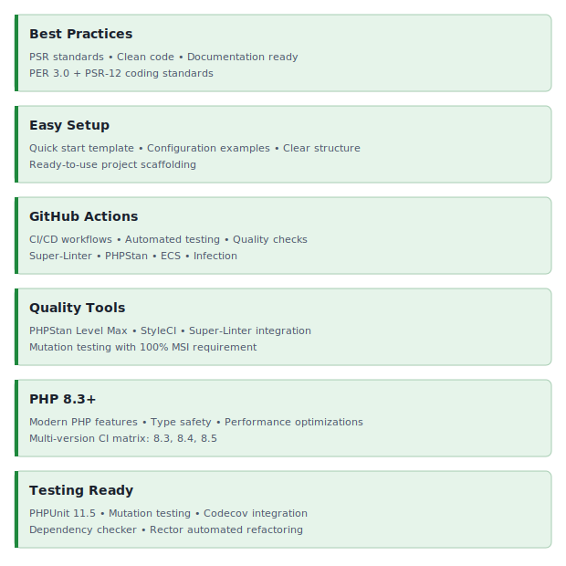

<!-- markdownlint-disable MD041 -->
<p align="center">
    <picture>
        <source media="(prefers-color-scheme: dark)" srcset="https://www.yiiframework.com/image/design/logo/yii3_full_for_dark.svg">
        <source media="(prefers-color-scheme: light)" srcset="https://www.yiiframework.com/image/design/logo/yii3_full_for_light.svg">
        
    </picture>
    <h1 align="center">Template</h1>
    <br>
</p>
<!-- markdownlint-enable MD041 -->

<p align="center">
    <a href="https://github.com/yii2-extensions/template/actions/workflows/build.yml" target="_blank">
        
    </a>
    <a href="https://dashboard.stryker-mutator.io/reports/github.com/yii2-extensions/template/main" target="_blank">
        
    </a>
    <a href="https://github.com/yii2-extensions/template/actions/workflows/static.yml" target="_blank">
        
    </a>
</p>

<p align="center">
    <strong>A Yii2 extension template to create your own Yii2 extensions</strong><br>
    <em>PHPUnit, PHPStan, Codeception, and best practices ready out of the box</em>
</p>

## Features

<picture>
    <source media="(min-width: 768px)" srcset="./docs/svgs/features.svg">
    
</picture>

## Quick start

### Installation

```bash
composer require github_username/github_repository-name
```

### Basic Usage

Describe how to use your extension in a basic way.

## Documentation

For detailed configuration options and advanced usage.

- 📚 [Installation Guide](docs/installation.md)
- ⚙️ [Configuration Reference](docs/configuration.md)
- 💡 [Usage Examples](docs/examples.md)
- 🧪 [Testing Guide](docs/testing.md)

## Package information

[](https://www.php.net/releases/8.1/en.php)
[](https://github.com/yiisoft/yii2/tree/2.0.53)
[](https://github.com/yiisoft/yii2/tree/22.0)
[](https://packagist.org/packages/yii2-extensions/template)
[](https://packagist.org/packages/yii2-extensions/template)

## Quality code

[](https://codecov.io/github/yii2-extensions/template)
[](https://github.com/yii2-extensions/template/actions/workflows/static.yml)
[](https://github.com/yii2-extensions/template/actions/workflows/linter.yml)
[](https://github.styleci.io/repos/698621511?branch=main)

## Our social networks

[](https://x.com/Terabytesoftw)

## License

[](LICENSE)
